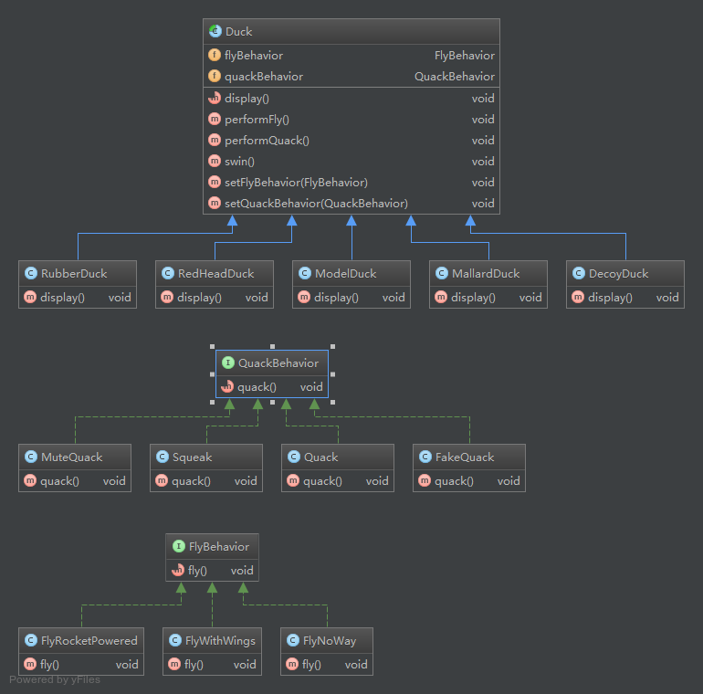

### 设计原则

+ 找出应用中可能需要变化之处，把它们独立出来，不要和那些不需要变化的代码混在一起。

+ 针对接口编程，而不是针对实现编程。
    
    > “针对接口编程”真正意思是“针对超类型(supertype)编程”。
    
+ 多用组合，少用继承。

    > 利用继承设计子类的行为，是在编译时静态决定的，而且所有的子类都会继承到相同的行为。然而，如果
    能利用组合的做法拓展对象的行为，就可以在运行时动态地进行拓展。

+ 为了交互对象之间的松耦合设计而努力。

    > 松耦合的设计之所以能让我们建立弹性的OO系统，能够应对变化，是因为对象之间的相互依赖降到了最低。

+ 开闭原则：类应该对拓展开放，对修改关闭。

    > 虽然似乎有些矛盾，但是的确有一些技术可以允许在不直接修改代码的情况下对其进行拓展。
    在选择需要被拓展的代码部分要小心。每个地方都采用开闭原则是一种浪费，也没必要，还会导致代码变得复杂且难以理解。

### 设计模式

+ 策略模式
    
    > 定义了算法族，分别封装起来，让它们之间可以相互替换，此模式让算法的变化独立于使用算法的客户。
    
+ 观察者模式

    > 定义了对象之间的一对多依赖，这样一来，当一个对象改变状态时，它的所有依赖者都会收到通知并自动更新。
    
+ 装饰者模式

    > 动态地将责任附加到对象上。若要拓展功能，装饰者提供了比继承更有弹性的替代方案。

### 章节要点

1. #### 设计模式入门

    + 知道OO基础，并不足让你设计出良好设计的系统。
    + 良好的OO设计必须具备可复用、可扩充、可维护三个特性。
    + 模式可以让我们建造出具有良好OO设计质量的系统。
    + 模式被认为是历经验证的OO设计经验。
    + 模式不是代码，而是针对设计问题的通用代码解决方案。你可以把它们应用到特定的应用中。
    + 模式不是被发明，而是被发现。
    + 大多数的模式和原则，都着眼于软件变化的主题。
    + 大多数的模式都允许系统局部改变独立于其他部分。
    + 我们通常把系统中会变化的部分抽出来封装。
    + 模式让开发人员之间有共享的语言，能够最大化沟通的价值。
    
2. #### 观察者模式

    + 观察者模式定义了对象之间一对多的关系。
    + 主题（也就是可观察者）用一个共同的接口来更新观察者。
    + 观察者和可观察者之间用松耦合方式结合，可观察者不知道观察者的细节，只知道观察者实现了观察者接口。
    + 使用此模式，你可从被观察者处推(push)或拉(pull)数据(然而，推的方式被认为更"正确")。
    + 有多个观察者时，不可以依赖特定的通知次序。
    + Java有多个观察者模式的实现，包括了通用的java.util.Observable。
    + 要注意java.util.Observable实现上所带来的一些问题。
    + 如果有必要的话，可以实现自己的Observable，这并不难，不要害怕。
    + Swing大量使用观察者模式，许多GUI框架也是如此。
    + 此模式也被应用在许多地方，例如：JavaBeans、RMI。
    
3. #### 装饰者模式
    
    + 继承属于拓展形式之一，但不见得是达到弹性设计的最佳方法。
    + 在我们的设计中，应该允许行为可以被拓展，而无须修改现有的代码。
    + 组合和委托可用于在运行时动态地加上新的行为。
    + 除了继承，装饰者模式也可以让我们拓展行为。
    + 装饰者模式意味着一群装饰者类，这些类用来包装具体组件。
    + 装饰者类反映出被装饰者的组件类型（事实上，他们具有相同的类型，都经过接口或继承实现）。
    + 装饰者可以在被装饰者的行为前面与/或后面加上自己的行为，甚至将被装饰者的行为整个取代掉，而达到特定的目的。
    + 你可以使用无数个装饰者来包装一个组件。
    + 装饰者一般对组件的客户是透明的，除非客户程序依赖于组件的具体类型。
    + 装饰者会导致设计中出现许多小对象，如果过度使用，会让程序变得很复杂。

### 类图

1. #### 策略模式

    

