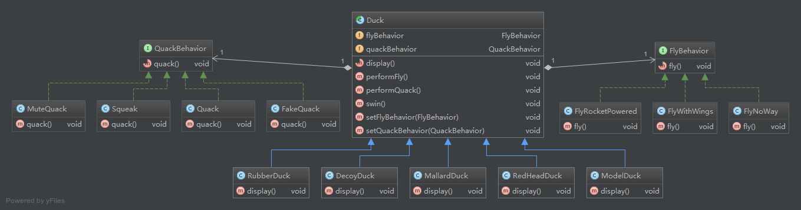

### 设计原则

+ 找出应用中可能需要变化之处，把它们独立出来，不要和那些不需要变化的代码混在一起。

+ 针对接口编程，而不是针对实现编程。
    
    > “针对接口编程”真正意思是“针对超类型(supertype)编程”。
    
+ 多用组合，少用继承。

+ 为了交互对象之间的松耦合设计而努力。

    > 松耦合的设计之所以能让我们建立弹性的OO系统，能够应对变化，是因为对象之间的相互依赖降到了最低。

+ 

### 设计模式

+ 策略模式
    
    > 定义了算法族，分别封装起来，让它们之间可以相互替换，此模式让算法的变化独立于使用算法的客户。
    
+ 观察者模式

    > 定义了对象之间的一对多依赖，这样一来，当一个对象改变状态时，它的所有依赖者都会收到通知并自动更新。
    

### 章节要点

1. #### 设计模式入门

    + 知道OO基础，并不足让你设计出良好设计的系统。
    + 良好的OO设计必须具备可复用、可扩充、可维护三个特性。
    + 模式可以让我们建造出具有良好OO设计质量的系统。
    + 模式被认为是历经验证的OO设计经验。
    + 模式不是代码，而是针对设计问题的通用代码解决方案。你可以把它们应用到特定的应用中。
    + 模式不是被发明，而是被发现。
    + 大多数的模式和原则，都着眼于软件变化的主题。
    + 大多数的模式都允许系统局部改变独立于其他部分。
    + 我们通常把系统中会变化的部分抽出来封装。
    + 模式让开发人员之间有共享的语言，能够最大化沟通的价值。
    
2. #### 观察者模式

    + 观察者模式定义了对象之间一对多的关系。
    + 主题（也就是可观察者）用一个共同的接口来更新观察者。
    + 观察者和可观察者之间用松耦合方式结合，可观察者不知道观察者的细节，只知道观察者实现了观察者接口。
    + 使用此模式，你可从被观察者处推(push)或拉(pull)数据(然而，推的方式被认为更"正确")。
    + 有多个观察者时，不可以依赖特定的通知次序。
    + Java有多个观察者模式的实现，包括了通用的java.util.Observable。
    + 要注意java.util.Observable实现上所带来的一些问题。
    + 如果有必要的话，可以实现自己的Observable，这并不难，不要害怕。
    + Swing大量使用观察者模式，许多GUI框架也是如此。
    + 此模式也被应用在许多地方，例如：JavaBeans、RMI。
    

### 类图

1. #### 策略模式

    

